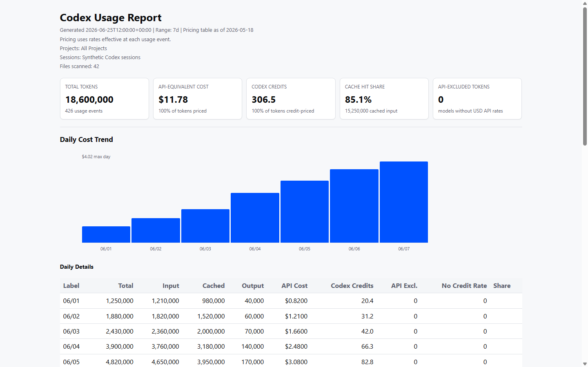

# Codex Usage Dashboard

Local tooling for understanding Codex token usage, project activity, Codex credits, and API-equivalent cost from Codex session JSONL logs.



This repository contains:

- A Python CLI, `codex-usage`, for parsing local Codex session logs.
- A Windows x64 and macOS Apple Silicon VS Code extension preview that bundles the Python CLI.
- A dependency-light dashboard report rendered with local HTML, CSS, and inline SVG.

## VS Code Preview Packages

The current preview packages support Windows x64 and macOS Apple Silicon only. Each package is self-contained at runtime and does not require Python, `uv`, or this repository after installation. Both native packaged version-3 Task Transfer smoke gates remain pending and must pass before publication: Windows x64 and macOS Apple Silicon. Linux packaging is a follow-up and is not a supported target in this release.

Build and install the local macOS Apple Silicon VSIX:

```bash
cd extensions/vscode
npm run package:vsix:mac
code --install-extension ../../output/releases/codex-usage-dashboard-darwin-arm64.vsix --force
```

Available commands:

- `Codex Usage: Open Dashboard`
- `Codex Usage: Refresh Dashboard`
- `Codex Usage: Select Range`
- `Codex Usage: Select Projects`
- `Codex Usage: Review Project Transitions`
- `Codex Usage: Select Theme`
- `Codex Usage: Task Transfer`
- `Codex Usage: Choose Transfer Folder`
- `Codex Usage: Import Tasks`
- `Codex Usage: Export Tasks`
- `Codex Usage: Review Transfer Status`
- `Codex Usage: Open Transfer Folder`
- `Codex Usage: Open Settings`

## CLI Usage

```powershell
uv sync
uv run codex-usage summary --range 7d --by project
uv run codex-usage summary --range all --by hour --json
uv run codex-usage summary --range month --by model --csv output/monthly-models.csv
uv run codex-usage report --range 30d --output output/report.html
uv run codex-usage report --range all --theme night --output output/night-report.html
uv run codex-usage transitions suggest --json
```

### Internal CLI

The VS Code extension invokes the technical commands below. Their `sync`,
`thread_id`, and `threads` names are private compatibility contracts, not
user-facing Task Transfer terminology.

```powershell
uv run codex-usage threads --project-key https://github.com/example/demo --json
uv run codex-usage sync inventory --sync-dir D:\CodexSync --json
uv run codex-usage sync pull --sync-dir D:\CodexSync --thread-id <thread-id> --json
uv run codex-usage sync push --sync-dir D:\CodexSync --thread-id <thread-id> --json
uv run codex-usage sync status --sync-dir D:\CodexSync --thread-id <thread-id> --json
```

By default, the tool looks for Codex session storage at:

- `CODEX_HOME/sessions`
- `CODEX_HOME/archived_sessions`
- `%USERPROFILE%\.codex\sessions`
- `%USERPROFILE%\.codex\archived_sessions`
- `~/.codex/sessions`
- `~/.codex/archived_sessions`

Dashboard and usage-report discovery includes active and archived session roots when they exist. Task Transfer exports only from the active `sessions` roots. Set `CODEX_HOME` when you need to point the CLI at a different Codex home for testing or migration.

Dashboard theme defaults to `auto`. In standalone HTML, auto follows the browser/system color-scheme preference. In VS Code, auto follows the active VS Code theme. You can force a report with `--theme day` or `--theme night`, or set `CODEX_USAGE_THEME`.

### Performance Cache

The VS Code preview stores a local SQLite cache under VS Code global extension storage. The first dashboard open may say "Initializing Codex usage cache" and take a few seconds while existing Codex JSONL files are parsed. Later range switches and project pickers reuse unchanged parsed rows and should usually feel much faster. The cache is local only, can be rebuilt automatically after schema changes, and does not change pricing semantics because costs are still calculated from checked-in effective-dated rates at report time.

### Codex Fast Mode

Codex fast mode is counted through the token usage that Codex records. Current Codex session JSONL files do not expose a durable per-turn fast-mode marker or exact charged-credit field, so the dashboard cannot label GPT-5.5 fast-mode turns separately from regular GPT-5.5 turns.

## What The Dashboard Shows

- Total tokens and usage event counts
- API-equivalent USD using checked-in effective-dated pricing
- Codex credit estimates
- Cache hit share
- Daily and hourly usage patterns
- Project, model, and session rollups

The report uses no remote assets, JavaScript, or Python chart libraries. It is safe to open locally and is designed to fit inside a VS Code webview.
The dashboard uses the same tokenized day/night design system as the VS Code extension, including dark-mode-friendly charts and tables.

## Task Transfer

Task Transfer deliberately moves selected active Codex tasks between computers through a transfer folder managed by OneDrive, Dropbox, iCloud Drive, Syncthing, a network drive, or another filesystem provider. It is optional: token reporting works without Task Transfer and no transfer runs in the background. Codex's built-in handoff can fail on a very large task; Task Transfer preserves that task as a full JSONL so it can continue on another computer without summarizing or repackaging its context.

1. On the source computer, run **Export Tasks** and select the active tasks to transfer.
2. Wait for the filesystem provider to finish copying the transfer folder.
3. Clone or copy the corresponding project checkout to the destination computer if it is not already there.
4. When using only the Codex IDE extension, open that checkout in VS Code.
5. Run **Import Tasks**, select the tasks, and accept an automatic project match or choose a validated local folder.
6. Reload VS Code or restart the Codex app so the imported tasks appear.

The Codex desktop app is not required. An IDE-only workflow uses open VS Code workspace folders as destination candidates. Git-backed projects are matched and validated by normalized Git origin; a chosen folder with the wrong origin is rejected. For a non-Git project, the extension shows the source and destination and asks for confirmation because the mapping cannot be verified automatically. Task Transfer never clones a project, so its destination checkout must already exist.

Every **Import Tasks**, **Export Tasks**, and **Review Transfer Status** operation starts with a fresh, empty selection. Review inspects task state without copying files. Project rows select only the tasks visible for that operation, and neither task selections nor project mappings are saved. Imported tasks remain in the transfer folder, and forgetting or changing the folder does not delete any task files.

The full selected batch is checked before any file is copied. Conflicts, malformed folder structures, changed source files, unsafe mappings, and tasks that need the opposite direction block the complete operation. Existing local tasks keep their current checkout path. The extension does not write Codex private SQLite or application state.

The current portable layout stores one byte-preserved JSONL per task:

```text
<transfer-folder>/
  sync-index.json
  tasks/
    <portable-task-filename>.jsonl
```

Valid version-2 folders are migrated automatically to this version-3 layout before Import, Export, or Review. The transfer menu also lets you choose, change, open, or forget the remembered folder. Only the folder path is remembered.

## Archived And Deleted Tasks

The dashboard treats token usage as historical usage. Archiving a Codex task moves its JSONL file to `archived_sessions`, and those files are included in totals. If a task file disappears after the dashboard cache has seen it, its parsed usage is retained as historical usage and marked as a retained missing file.

To observe how your installed Codex build handles deletion:

```powershell
uv run codex-usage storage snapshot --json > output\before-delete.json
# delete one test task in Codex
uv run codex-usage storage snapshot --json > output\after-delete.json
uv run codex-usage summary --range all --by project --json > output\after-delete-summary.json
```

Do not use a task you still need for Task Transfer testing. The dashboard can preserve usage after it has parsed a file, but it cannot restore a deleted Codex task.

## Accounting And Pricing

The parser reads cumulative `total_token_usage` records and counts only positive deltas between token-count events. This avoids double-counting repeated records while still allowing daily and hourly reports for long sessions.

Project grouping uses `git.repository_url` when present, local `.git/config` origin remotes resolved from `cwd` when needed, then normalized `cwd`, then the session id. Automatic project transition detection handles high-confidence repository switches within a task without manual alias configuration.

Pricing uses checked-in effective-dated rate schedules. Each retained usage event is priced with the API USD and Codex credit rates active at that event's timestamp, so future price changes can be added without rewriting historical reports.

GPT-5.6 Sol, Terra, and Luna use official API rates for usage recorded from June 26, 2026 onward. Their Codex credit estimates start July 9, 2026, remain flat across context length, and use the public credit rate card. Reasoning effort such as `ultra` does not change the per-token rate; any additional work is reflected in the recorded token totals.

The official `gpt-5.6` model alias is priced as GPT-5.6 Sol. Other variants such as `gpt-5.6-pro`, `gpt-5.6-mini`, and wrapper names remain visible but unpriced unless they exactly match a checked-in model id or explicit alias.

For GPT-5.6 API USD, exactly 272,000 input tokens is short-context pricing. More than 272,000 input tokens, including 272,001, prices the full retained request event at long-context API rates. Long rates per 1M tokens are: Sol $10 uncached input, $1 cached input, $45 output; Terra $5 uncached input, $0.50 cached input, $22.50 output; Luna $2 uncached input, $0.20 cached input, $9 output. The long-context multiplier does not apply to Codex credits.

The parser reads cumulative `total_token_usage` records but reports only retained positive deltas. A local audit of GPT-5.6 Sol sessions found retained positive deltas matched request-level `last_token_usage`, so pricing is per retained event and cumulative session totals cannot trigger long-context pricing.

The tool does not fetch live pricing. Cost and credit values are estimates based on the checked-in pricing table version shown in each report. New Codex models may appear in local logs before this repository has official checked-in rates for them; those models remain visible in totals and model mix, but their API USD and Codex credit estimates are excluded until exact effective-dated rates are checked in.

For GPT-5.6 and later API models, explicit cache writes can have a separate 1.25x input charge. Local Codex logs expose cached-input reads but no distinct cache-write token count, so API-equivalent USD applies the standard input rate to non-cached input and cannot include an unobservable cache-write uplift.

## Project Transitions

Codex can continue one task after you ask it to work in another local repository. By default, reports apply automatic high-confidence transition detection when a timestamped Codex event references an existing local path, that path resolves to a repository with a `.git/config` origin remote, and the task already has usage under a different source project. Usage before the transition timestamp stays with the source project; usage after the timestamp moves to the detected target project.

The detector uses read-only evidence from local Codex session JSONL files and, when present, project paths and timestamps from the local Codex database. It does not upload this data, make network calls, mutate SQLite, or include SQLite databases in Task Transfer.

Casual repository name mentions do not split usage because the detector requires verified local path evidence. Dashboard reports show transition source, target, effective timestamp, and confidence. Detailed evidence and Task IDs are available through `Codex Usage: Review Project Transitions`.

Use `uv run codex-usage transitions suggest --json` to review inferred transitions directly. Pass `--no-auto-transitions` to summary and report commands when you want the original project grouping without automatic splits.

## Privacy

Codex Usage Dashboard is local-first:

- It reads local Codex session JSONL files.
- Project transition detection can also read local Codex project paths and timestamps as read-only evidence.
- It writes local reports.
- It does not upload session logs.
- It does not include telemetry.
- It does not fetch live pricing.

See [PRIVACY.md](PRIVACY.md) for details. The screenshot above uses synthetic data.

## Development

Python:

```powershell
uv run pytest
```

VS Code extension:

```powershell
cd extensions/vscode
npm install
npm test
```

Release checklist: [docs/release.md](docs/release.md).
