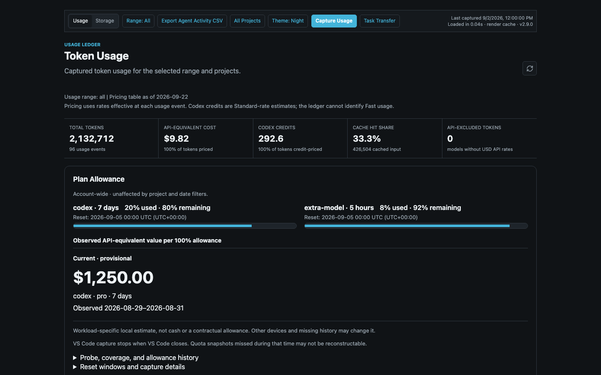
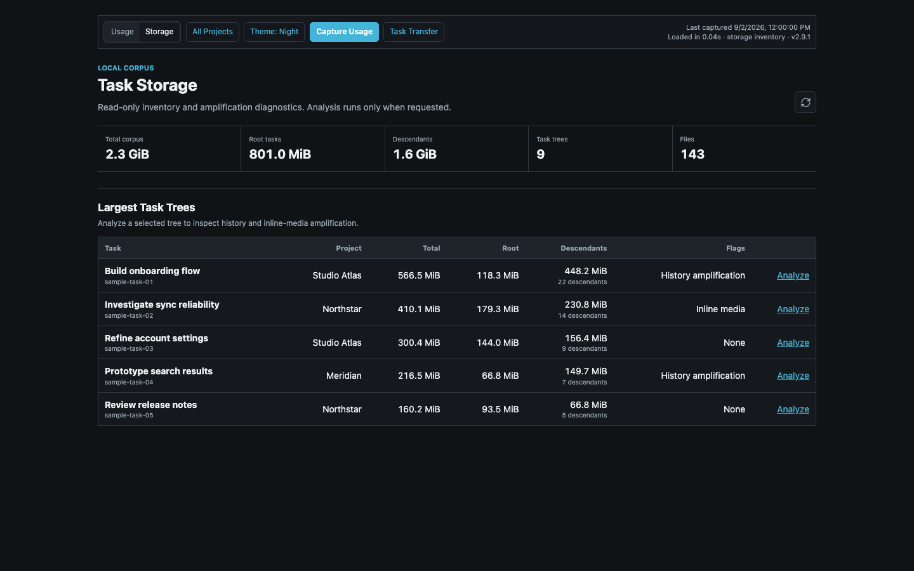

# Codex Usage

Codex Usage is a local toolkit for understanding Codex token usage, model mix,
project activity, and task storage. The VS Code extension includes its own collector. Scheduled capture runs while
VS Code is open, including when the dashboard is closed.

Everything stays on your computer. Capturing usage does not call a model or the
OpenAI API.



## Highlights

- **Persistent local history:** captured usage remains in the ledger after a
  source task is archived or deleted.
- **Low-I/O collection:** the default schedule runs every 15 minutes. Unchanged
  cycles inspect metadata but open zero JSONLs; normal appends read only guard
  windows and the new tail.
- **Immediate capture:** **Capture Usage** coalesces with any running capture and
  resets the next scheduled interval after success.
- **Fast reports:** preset and inclusive local-calendar custom ranges, project
  filters, theme changes, Agent Activity, and CSV export query the ledger
  without reopening task files. Long ranges retain a script-free **Week |
  Month** cost view inside the rendered report.
- **Agent Activity:** inspect daily token and response deltas plus the top 50
  agents in a collapsed detail table, then export every selected agent-day row
  to CSV; the Daily Summary stays visible.
- **Image Generation:** inspect global, model, and project image operations
  separately from language tokens and costs; historical coverage reports
  complete, pending, unavailable, and artifact counts, while incomplete or
  conflicting billing evidence remains explicit.
- **Honest accounting:** Project Breakdown separates root tasks from structured
  subagents and stacks each role by model. Side chats remain disclosed under
  their parent root task when Codex stores no durable discriminator.
- **Task Storage:** inspect current disk use and explicitly analyze one selected
  task tree for history amplification and inline media.
- **Task Transfer:** deliberately export or import selected active tasks from one
  project at a time through a user-managed folder.

## Install

Install [Codex Usage Companion](https://marketplace.visualstudio.com/items?itemName=wenjun-mao.codex-usage-dashboard)
from the VS Code Marketplace. Separate macOS Apple Silicon and Windows x64
packages each include the matching local collector; the native app, Python,
`uv`, and this repository are not required.

Intel macOS, Windows ARM64, and Linux are not supported in the 2.9.0 release.

## First Run And Legacy Service Handoff

Open **Codex Usage: Set Up Collector** from the Command Palette and select the
Codex home containing `sessions` or `archived_sessions`. The usual location is
`~/.codex` on macOS or `%USERPROFILE%\\.codex` on Windows. The collector uses
this home's existing `CODEX_HOME/.codex-usage/usage-ledger.sqlite3`; installing
the extension does not reset usage history or task data. Codex Usage supports
one active Codex home at a time.

If an older native preview registered a Codex Usage background service, the
extension can attach to its healthy collector. To retire that registration,
run **Codex Usage: Retire Legacy Background Service** and review the explicit
handoff prompt. Accepting unregisters only the known Codex Usage service and
waits for its writer to exit; if VS Code already owns the collector, it keeps
running. Handoff verifies the same home, ledger, and a successful capture.
Refusing leaves the service in place. Do this before uninstalling the old native
preview, and preserve the shared `.codex-usage` directory when uninstalling.
If handoff fails, follow the reported recovery action and retry after resolving
the error; **Reset Local Data** is not a handoff step.

The extension captures at the configured interval while VS Code remains open.
Closing the last VS Code extension host stops its parent-bound collector. On
reopening, capture resumes against the same ledger. Quota snapshots missed while
VS Code is closed may be impossible to reconstruct later; inspect the report's
observation timestamps before treating a quota history as continuous.

## Capture And History

The collector reconciles active and archived task directories at the configured
interval. Filesystem notifications only mark paths as dirty; notification
callbacks never read task content. Overdue work after startup, sleep/wake, or a
watcher recovery produces one catch-up rather than replaying every missed tick.

Historical image recovery participates in startup, scheduled, and manual
captures. Each capture reads at most four 16 MiB rollout slices (64 MiB total),
serving new recent artifact owners first and then rotating the least recently
served owners. Missing or ambiguous owners are reported as unavailable without
blocking a valid owner from using the bounded slice.

The status header shows the last capture, next scheduled capture, pending files
and bytes, baseline progress, and stale-source warnings. Use **Capture Usage**
when you want current data immediately.

Run **Capture Usage before manually deleting a Codex task**. A scheduled interval
can leave an uncaptured tail of up to that interval. Once a generation is in the
ledger, its usage is retained when the JSONL disappears, but Codex Usage cannot
restore a deleted task.

The durable ledger lives at:

```text
CODEX_HOME/.codex-usage/usage-ledger.sqlite3
```

It uses forward, backup-protected migrations and is written only by the single
collector process. Task Storage content diagnostics use a separate disposable
database.

## Usage

Open **Usage** to review:

- total, input, cache-read, cache-write, and output tokens;
- effective-dated API-equivalent USD and estimated Codex credits;
- daily and hourly patterns, with all-history costs switchable between local-calendar Monday-through-Sunday weeks and calendar months while the detail table stays daily;
- inclusive custom local-calendar dates, including single-day ranges, with
  daily charts through 90 days and readable Week/Month periods for longer spans;
- Agent Activity daily totals with the highest-token agents collapsed by
  default, plus a complete host-saved CSV for the selected range and project
  filter;
- ledger-only Project Economics with weighted all-project benchmarks plus
  project and model turn cost, density, coverage, and small-sample context;
- ledger-only Image Generation operations, outputs, model evidence, and
  expandable project coverage, including explicit incomplete-history counts,
  with image values never added to language totals;
- project totals and project transitions;
- root-task versus structured-subagent usage, split again by model;
- exact model details, including unknown or currently unpriced usage.

Choose a preset or **Custom date range**, project filter, and explicit Auto,
Day, or Night theme. Custom dates use the configured local timezone, include
both endpoints, reject future dates, and do not accept arbitrary timestamps.
Project Breakdown always shows role-level tokens and API-equivalent dollars.
The shared **Compare by** control scales both Project Breakdown and Model Mix by
either Tokens or API cost without rereading the ledger or task files.
For the all-history range, **Week | Month** defaults to Week and switches the
cost chart without another ledger query or report generation.
Models are presented by generation and product tier with stable, distinct
colors, while the bounded visual set still favors the highest-volume models.
Project Economics counts distinct non-empty project/task/turn identities and
weights the all-project benchmark from measured, priceable turns rather than
averaging project averages. Blank turn IDs remain in totals and coverage but
not turn denominators; unpriced usage remains in token totals and coverage but
not cost denominators. Detailed Token Accounting is collapsed by default, and
**Cache Write (reported)** always means the value stored in the selected ledger,
not a value inferred from cache reads or reconstructed while rendering.
Date, Agent Activity, export, and project changes query SQLite; chart-only controls do not. The reload icon re-queries the ledger without
capturing task files; **Capture Usage** is the separate action that updates the
ledger. The report shows generation time and whether its rendered-result cache was used.
Pricing is bundled and effective-dated; the app makes no live pricing request.
Image pricing is similarly effective-dated and applies only when retained
upstream usage and model evidence support it; image prompts, paths, bytes, and
contents are not stored in the ledger.
The bundled table recognizes GPT-6 Astra from September 4 and exact GPT-6 Sol
and Luna IDs from their September 22, 2026 launch. It applies published
standard API input, cached input, cache-write, and output rates, including the
full-request long-context multiplier above 272K input tokens. Earlier Sol and
Luna activity remains unpriced in USD. Their Codex credit rates have not been
published, so those tokens remain visibly unpriced in credit estimates.
See the [Sol model page](https://developers.openai.com/api/docs/models/gpt-6-sol),
[Luna model page](https://developers.openai.com/api/docs/models/gpt-6-luna),
and [API pricing](https://developers.openai.com/api/docs/pricing) for the rates.
Other credit estimates use published standard token rates; Codex Usage does not infer
plan-specific or Fast-mode multipliers because task records do not identify
them reliably. Estimates are not an OpenAI invoice and do not know the price of
your plan.

## Task Storage

Open **Task Storage** to see current physical JSONL usage by user-visible root
task tree. This inventory includes active and archived files, separates root
bytes from structured descendants, and is independent of the Usage date range.
It shares the selected project filter and theme with Usage; its reload icon
checks the current storage inventory without capturing token usage.



Choose **Analyze** on one tree to measure compacted-history amplification,
inline-media evidence, large descendants, and active-root history risk. Analysis
is selected-tree-only, cancellable, local, and limited to one shared heavy-I/O
lane. It does not invoke a model or scan unrelated trees opportunistically.
The app labels history amplification only after a complete analysis finds at
least 1 GiB of compacted rows representing at least 50% of the tree's logical
bytes. Until then, the result remains visibly **Not analyzed** or incomplete.

For a large task:

- Use **Fork in Codex** when conversational continuity is the priority. A fork
  is not a backup and does not guarantee smaller storage.
- Start a fresh task with a concise handoff when reducing inherited context and
  future growth is the priority.
- Verify the replacement before manually archiving or deleting the original in
  Codex.

Codex Usage does not create, fork, archive, restore, or delete tasks.

## Task Transfer

Task Transfer moves selected active task JSONLs between computers through a
folder managed by OneDrive, Dropbox, iCloud Drive, Syncthing, a network drive,
or another filesystem provider. It is explicit and never runs in the
background. Each Import or Export handles exactly one project.

### Export

1. Open **Task Transfer**, choose **Export**, and select a transfer folder.
2. Choose one project.
3. Choose the exact active tasks to export. No tasks are selected by default,
   and search is limited to that project.
4. Select **Export Selected** and wait for your filesystem provider to finish
   copying the transfer folder.

### Import

1. Clone or otherwise create the matching project checkout on the destination
   computer. Task Transfer does not clone repositories.
2. If using Codex Desktop, add the checkout as a local project and fully quit
   Desktop before Import. VS Code-only use does not require Desktop.
3. Open **Task Transfer**, choose **Import**, and select the same transfer
   folder.
4. Choose one transferred project, choose its tasks, and select the matching
   local checkout.
5. Review any unverified non-Git mapping, then choose **Import Selected**.
6. Start Codex Desktop after success, or reload VS Code in an IDE-only workflow,
   so Codex refreshes its visible task list.

Use **Review Status** to compare selected local and transferred tasks without
copying files. Use **Projects** to go back and choose a different project. Repeat
the operation for another project; one transfer folder can retain many projects.

The complete selected batch is checked before copying. Conflicts, malformed
layouts, changed sources, unsafe project mappings, opposite-direction work, a
running or indeterminate Desktop process, ambiguous Desktop projects, and
assignment conflicts fail closed. Import registers only certified files
through targeted Codex `app-server` reads. Registration does not start a turn or
consume tokens. Import atomically installs selected JSONLs but never edits their content
or writes Codex SQLite databases. Desktop project assignment is atomic, backed
up, and verified while Desktop is closed. Imported files remain in the transfer
folder, and only the transfer-folder path is retained as durable Task Transfer
configuration.

## Legacy Migration

Onboarding discovers schema-8 caches from supported VS Code variants and prior
home-directory locations. Unique generations and retained deleted-source history
can be imported into the durable ledger. Identical overlap is deduplicated;
genuinely divergent history asks which cache takes precedence. Migration is
resumable and auditable, and legacy databases are never changed.

## Privacy And Updates

The extension has no telemetry, cloud backend, Docker service, Codex hooks, or
model calls. Session content, usage rows, project paths, and Task Storage
diagnostics stay local. The Marketplace extension updates through VS Code. See
[PRIVACY.md](PRIVACY.md) for the complete data boundary.

## Development

The repository contains a Python collector/core and a TypeScript VS Code
extension under `extensions/vscode`. The Python executable and loopback protocol
are private implementation details; there is no public `codex-usage` console
script.

Run the core gates from the repository root:

```bash
uv sync --all-groups
uv run pytest -q
uv run ruff check .
```

Run the extension gates and build the matching VSIX on its platform:

```bash
cd extensions/vscode
npm ci
npm test
npm run package:vsix:mac  # macOS Apple Silicon
# npm run package:vsix:win  # Windows x64
```

Architecture decisions are indexed in [docs/adr](docs/adr/README.md). Release
checks and handoff acceptance are in [docs/release.md](docs/release.md).

## Plan Allowance

The account-wide Plan Allowance section shows active quota buckets and reset
metadata, plus the **Observed API-equivalent value of full allowance** when a
window has a valid priced fit. Fits need at least 10 percentage points; stronger
confidence also requires completed windows and the documented coverage and
sensitivity gates. If the newest window is not yet priceable, the headline can
show a dated **Previous window** estimate from the same limit, plan, and duration
series. It never borrows across series. Collapsed diagnostics list recent valid
priced windows, including current and provisional fits. Project and date filters
do not change this account-wide section.

Captures use official Codex App Server metadata reads without a model turn.
Unavailable probes do not fail ordinary capture. Historical recovery checks
registered sources newest-first with bounded endpoint reads, up to 8 MiB per
capture, and resumes automatically. Recovery is partial, with provenance and
coverage disclosed. Upgrades back up and preserve existing usage and checkpoints.
Report navigation reads only the ledger. No account identity, authentication,
prompts, or content is retained by allowance collection.

This is a local workload-specific API-equivalent estimate, not cash value or a
contractual entitlement. Other-device usage, missing history, model mix, and
pricing can affect it. Lifetime account tokens are coverage diagnostics only.
