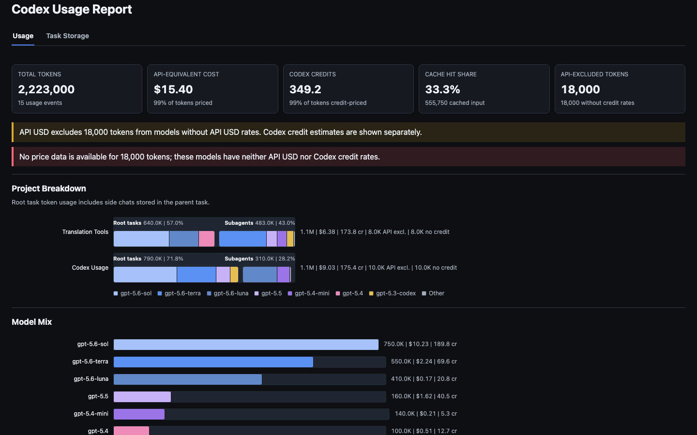
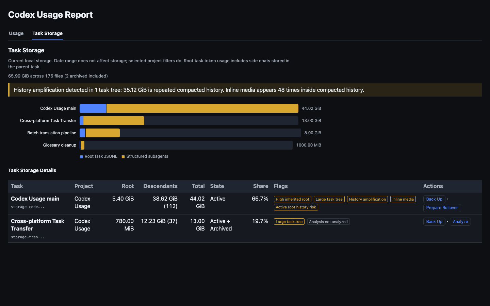

# Codex Usage Dashboard

Local-first Codex usage reporting for understanding project activity, token usage, Codex credits, and API-equivalent cost from local Codex session JSONL logs. Project Breakdown separates each project into user-visible root tasks and structured subagents, then stacks each role by model so the report explains both who used tokens and which models contributed.

## What The Dashboard Shows

- Two focused views keep date-filtered **Usage** separate from current **Task Storage**. Projects and theme apply to both; the date range applies only to Usage.
- Task Storage shows current local JSONL usage by user-visible root task tree, diagnoses repeated compacted-history and inline-media amplification on demand, and prepares guarded rollovers through a new verified backup.
- Project Breakdown separates each project into user-visible root tasks and structured subagents, then stacks each role by model.
- Model Mix uses shared model colors across the report. Model Details remains exact while crowded charts group models after the largest seven into visual-only `Other`.
- Total tokens and usage event counts, cache hit share, and daily/hourly usage patterns.
- API-equivalent USD using checked-in effective-dated pricing.
- Codex credits, estimated from recorded usage.
- Optional Task Transfer moves selected active tasks between computers; token reporting works without it.



## Quick Start

1. Run **Codex Usage: Open Dashboard** from the VS Code Command Palette.
2. Use **Usage** to review tokens, models, estimated API-equivalent cost, Codex credits, and root-task versus subagent activity. Change the date range or project filter from the toolbar.
3. Use **Task Storage** to see current disk usage by task tree. Choose **Analyze**, **Back Up**, or **Prepare Rollover** from a tree row as needed.
4. Use **Codex Usage: Task Transfer** only when you deliberately want to move selected active tasks between computers; reporting does not require it.

This repository contains:

- A Python CLI, `codex-usage`, for parsing local Codex session logs.
- A Windows x64 and macOS Apple Silicon VS Code extension that bundles the Python CLI.
- A dependency-light dashboard report rendered with local HTML, CSS, and inline SVG.

## VS Code Packages

The stable packages support Windows x64 and macOS Apple Silicon only. Each package is self-contained at runtime and does not require Python, `uv`, or this repository after installation. The release workflow runs both native packaged version-3 Task Transfer smoke gates, one on Windows x64 and one on macOS Apple Silicon, and requires them to pass before publication. Additional packaged gates cover report and cache behavior, verified task backups, and storage analysis, including zero-byte warm-analysis reuse; they must also pass. Intel macOS and Windows ARM64 are not supported targets in this release. Linux packaging is a follow-up and is not a supported target in this release.

Build and install the local macOS Apple Silicon VSIX:

```bash
cd extensions/vscode
npm run package:vsix:mac
code --install-extension ../../output/releases/codex-usage-dashboard-darwin-arm64.vsix --force
```

Available commands:

- `Codex Usage: Open Dashboard`
- `Codex Usage: Refresh Dashboard`
- `Codex Usage: Select Range`
- `Codex Usage: Select Projects`
- `Codex Usage: Review Project Transitions`
- `Codex Usage: Select Theme`
- `Codex Usage: Task Transfer`
- `Codex Usage: Choose Transfer Folder`
- `Codex Usage: Import Tasks`
- `Codex Usage: Export Tasks`
- `Codex Usage: Review Transfer Status`
- `Codex Usage: Back Up Task`
- `Codex Usage: Analyze Task Storage`
- `Codex Usage: Prepare Task Rollover`
- `Codex Usage: Open Transfer Folder`
- `Codex Usage: Open Settings`

## CLI Usage

```powershell
uv sync
uv run codex-usage summary --range 7d --by project
uv run codex-usage summary --range all --by hour --json
uv run codex-usage summary --range month --by model --csv output/monthly-models.csv
uv run codex-usage report --range 30d --output output/report.html
uv run codex-usage report --range all --theme night --output output/night-report.html
uv run codex-usage storage snapshot --json
uv run codex-usage storage analyze --tree-id <tree-id> --json --progress-json
uv run codex-usage storage backup --tree-id <tree-id> --output task.codex-task-backup --compression balanced
uv run codex-usage storage verify task.codex-task-backup
uv run codex-usage storage rollover --tree-id <tree-id> --output task-rollover.codex-task-backup --compression maximum --json
uv run codex-usage transitions suggest --json
```

### Internal CLI

The VS Code extension invokes the technical commands below. Their `sync`,
`thread_id`, and `threads` names are private compatibility contracts, not
user-facing Task Transfer terminology.

```powershell
uv run codex-usage threads --project-key https://github.com/example/demo --json
uv run codex-usage sync inventory --sync-dir D:\CodexSync --json
uv run codex-usage sync pull --sync-dir D:\CodexSync --thread-id <thread-id> --json
uv run codex-usage sync push --sync-dir D:\CodexSync --thread-id <thread-id> --json
uv run codex-usage sync status --sync-dir D:\CodexSync --thread-id <thread-id> --json
```

By default, the tool looks for Codex session storage at:

- `CODEX_HOME/sessions`
- `CODEX_HOME/archived_sessions`
- `%USERPROFILE%\.codex\sessions`
- `%USERPROFILE%\.codex\archived_sessions`
- `~/.codex/sessions`
- `~/.codex/archived_sessions`

Dashboard and usage-report discovery includes active and archived session roots when they exist. Task Transfer exports only from the active `sessions` roots. Set `CODEX_HOME` when you need to point the CLI at a different Codex home for testing or migration.

Dashboard theme defaults to `auto`. In standalone HTML, auto follows the browser/system color-scheme preference. In VS Code, auto follows the active VS Code theme. You can force a report with `--theme day` or `--theme night`, or set `CODEX_USAGE_THEME`.

### Performance Cache

The VS Code extension stores a local SQLite cache under VS Code global extension storage. The first `1.7.0` report rebuilds the disposable schema 8 cache once. Later reports query only the selected time range from SQLite, value each retained record once, and reuse that valuation across totals, timeline rows, and Project Breakdown. Schema 8 also retains guarded Task Storage content diagnostics whenever the usage parser has already read a file. The cache remains local and pricing still uses checked-in effective-dated rates. The dashboard toolbar shows `Loaded in X.X seconds` for the report currently displayed.

Unchanged refreshes open no session JSONLs. When a Codex-owned active JSONL grows, schema 8 verifies its path, OS file identity, task ID, head digest, and 64 KiB old-boundary digest before restoring the parser checkpoint's model, turn, role, fork, metadata, cumulative-token state, and content observer and reading only fixed guard windows plus the new tail. Replacement, truncation, same-size modification, unavailable identity, digest mismatch, invalid state, or any archived-file change falls back to a full parse. File inventory captures a fixed readable size, so growth during parsing waits for the next refresh. Incomplete final rows are deferred without losing their starting offset.

At most four read-only workers use buffered binary I/O to parse groups of eight files in descending unread-byte order. SQLite remains in the parent process and atomically commits records, metadata, transition candidates, fingerprints, and checkpoints; a failure retains the prior complete generation. Task Transfer metadata discovery reads one bounded line at a time and stops as soon as it finds valid `session_meta`. Range-aware queries use cached UTC-microsecond timestamps, while refresh coordination keeps only the latest request pending behind an active report. Cache diagnostics in the timing sidecar and VS Code Output channel distinguish full parses, append parses, append fallbacks, and source bytes read.

### Task Storage

The dashboard's **Task Storage** view and `codex-usage storage snapshot` command report the current local corpus separately from date-filtered Usage. The view groups physical JSONL files into user-visible root task trees, separates root-task bytes from nested structured-descendant bytes, includes both active and archived files, and applies the selected project filter while remaining independent of the usage date range. The dashboard shows the largest trees as horizontal bars and lists the complete inventory with logical file bytes, file counts, state, share, analysis coverage, and diagnostic flags. A root-size badge appears at 1 GiB and a tree-size badge at 10 GiB; these are visibility thresholds, not deletion recommendations or reclaimable-space estimates.

Codex guardian approval logs are preserved as structured descendants of their explicit owning task. Their bytes and verified backups stay with that task tree, while their recorded `codex-auto-review` tokens remain visible under **Subagents** in Usage; they are not hidden or presented as user-created roots.



Task trees can become large when compacted history or inline media is repeated across later rows and structured descendants. Visible task count, turn count, and subagent count do not explain that growth by themselves. Run **Analyze** on one selected tree to measure repeated compacted-history rows, inline-media markers, large descendants, and active-root history risk. Analysis uses at most four local read-only workers and updates guarded diagnostics atomically; it does not invoke a model or scan unrelated trees.

#### Analyze One Task Tree

1. Open **Task Storage** and optionally use the project filter to narrow the table.
2. Choose **Analyze** on the task row, or run **Codex Usage: Analyze Task Storage** and choose one project and one task tree.
3. Wait for the selected-tree scan to finish and the dashboard row to refresh.
4. Review total size together with **History amplification**, **Inline media**, descendant concentration, and active-root history risk. A `not analyzed` or `partial` result means the evidence is incomplete, not that the risk is absent.

A positive **History amplification** label requires complete analysis, at least 1 GiB of compacted rows, and compacted history representing at least 50% of the tree. **Inline media** additionally requires media markers inside that amplified history. `not analyzed` or `partial` is intentionally shown as unknown, never as evidence that amplification is absent. Marker counts are diagnostic clues rather than decoded media size or reclaimable-space estimates. The investigation behind these rules is recorded in [Task Storage Amplification](docs/knowledge/task-storage-amplification.md).

Codex documentation describes side chats as ephemeral forks. In the observed local format, a side-chat turn is stored in its parent root JSONL without a separate task, file, or durable discriminator. Its bytes and token usage therefore remain under **Root task**, and the report discloses that inclusion rather than inventing a heuristic third role. A future separate side-chat breakdown requires reliable upstream metadata and will not retroactively guess older records.

### Verified Task Backups

1. Open **Task Storage** and choose **Back Up** on one task row, or run **Codex Usage: Back Up Task** and choose one project and one task tree.
2. Choose **Maximum** for the smallest, slower archive or **Balanced** for a faster, larger archive.
3. Review the sensitive-data warning, choose a `.codex-task-backup` destination, and wait for copying and verification to finish.
4. Trust the result only after it is reported as recovery-ready or integrity-verified salvage. Review salvage warnings in the **Codex Usage** Output channel.

Task Storage backs up exactly one selected task tree. It preserves every physical JSONL currently present in that tree, including structured descendants such as guardian approval logs, active and archived copies, duplicates, and side-chat content already embedded in the root JSONL. The `.codex-task-backup` archive is a streaming PAX tar compressed as exactly one zstd frame with a strict format-v1 manifest. It records canonical metadata, per-file SHA-256 values, bounded selected session-index entries, and reports a final whole-archive SHA-256.

Choose **Maximum** for zstd 19 and smaller, slower archives, or **Balanced** for zstd 9 and faster, larger archives. Source identity is checked before, during, and after copying, and the complete selected tree is inventoried again before publication. The archive is written to a sibling partial file, fully reread and verified, then atomically published; cancellation or failure leaves no reported final archive, and an existing backup is preserved unless verified replacement succeeds. Graceful failures clean partials; forced process termination can leave an unreported hidden sibling partial that is never treated as the requested backup.

Missing roots, relationship cycles, or storage-metadata diagnostics are recorded as warnings in a structurally verified salvage archive. Transient metadata reads are retried; while any corpus file remains unreadable or unresolved, no backup is labeled recovery-ready because that file's parent tree cannot be proven. Such an archive is not marked recovery-ready. Backups can contain prompts and source code; they are compressed but not encrypted, remain local, and do not use telemetry or the network. Store them as sensitive source material. The current extension can create and verify backups but cannot restore them. Backups do not delete tasks or free storage.

### Prepare Rollover

1. In **Task Storage**, choose **Analyze** on the old task and wait for the refreshed row. Rollover is offered only when analysis is complete, the tree is large or history-amplified, and it is recovery-ready.
2. Choose **Prepare Rollover**, choose compression, and save to a new backup filename. Rollover never replaces an existing archive.
3. After verification, use the text-only starter prompt copied to the clipboard and follow the checklist in the **Codex Usage** Output channel.
4. Create a fresh root task in the same Codex project, paste the starter prompt, and verify that the new task can continue the work.
5. Only then archive or delete the old task inside Codex if you want to reclaim its local storage.

The plugin does not create, archive, restore, or delete Codex tasks. Preparing rollover establishes a verified recovery point and continuity material, but it does not reduce disk usage by itself. Storage is reclaimed only after you complete the final Codex-owned lifecycle step yourself.

### Codex Fast Mode

Codex fast mode is counted through the token usage that Codex records. Current Codex session JSONL files do not expose a durable per-turn fast-mode marker or exact charged-credit field, so the dashboard cannot label GPT-5.5 fast-mode turns separately from regular GPT-5.5 turns.

The report uses no remote assets, JavaScript, or Python chart libraries. It is safe to open locally and is designed to fit inside a VS Code webview.
The dashboard uses the same tokenized day/night design system as the VS Code extension, including dark-mode-friendly charts and tables.

## Task Transfer

Task Transfer deliberately moves selected active Codex tasks between computers through a transfer folder managed by OneDrive, Dropbox, iCloud Drive, Syncthing, a network drive, or another filesystem provider. It is optional: token reporting works without Task Transfer and no transfer runs in the background. Codex's built-in handoff can fail on a very large task; Task Transfer preserves that task as a full JSONL so it can continue on another computer without summarizing or repackaging its context.

1. On the source computer, run **Codex Usage: Task Transfer**, choose **Choose Transfer Folder**, and select a folder managed by your filesystem provider.
2. Choose **Export Tasks**, select one project, then select the active tasks from that project. No tasks are selected by default.
3. Wait until the filesystem provider has finished copying the transfer folder.
4. On the destination computer, make sure the corresponding project checkout already exists. If you use only the Codex IDE extension, open that checkout in VS Code.
5. On the destination computer, if you use Codex Desktop, add that checkout as an existing local project and fully quit Desktop. Then choose the same transfer folder and run **Import Tasks**.
6. Select the transferred project and tasks. Accept the automatic project match or choose a validated local folder for the project when prompted.
7. After a successful Desktop assignment, start Codex Desktop. In a VS Code-only workflow, reload VS Code so the imported tasks appear.

Use **Review Transfer Status** to compare selected local and transferred tasks without copying files. Use **Open Transfer Folder** to inspect the user-managed folder.

The Codex desktop app is not required. An IDE-only workflow uses open VS Code workspace folders as destination candidates. When Desktop state exists, Import requires Desktop to be closed and the destination to match exactly one existing local Desktop project. Git-backed projects are matched and validated by normalized Git origin; a chosen folder with the wrong origin is rejected. For a non-Git project, the extension shows the source and destination and asks for confirmation because the mapping cannot be verified automatically. Task Transfer never clones a project, so its destination checkout must already exist.

Each Import or Export handles one Codex project. First choose one project, then choose one or more eligible tasks from that project. No tasks are selected by default. Search on the task screen is limited to the chosen project. Use Back to discard the current task choices and choose a different project. Repeat the operation to transfer tasks from another project. The transfer folder can retain tasks from many projects across separate operations. Review Transfer Status remains cross-project and does not copy files. Neither task selections nor project mappings are saved. Imported tasks remain in the transfer folder, and forgetting or changing the folder does not delete any task files.

The full selected batch is checked before any file is copied. Conflicts, malformed folder structures, changed source files, unsafe mappings, a running or indeterminate Desktop process, a missing or ambiguous Desktop project, conflicting assignments, and tasks that need the opposite direction block the complete operation. Existing local tasks keep their current checkout path.

After certified task files are copied during Import, Codex Usage asks an installed official Codex runtime to register the selected tasks through targeted `app-server` task-read requests. Registration sends targeted reads only: it does not invoke a model, send a prompt, or start a turn. Codex Usage never writes Codex SQLite or task JSONLs. When Desktop state exists, it then atomically adds only the successfully registered task-to-project assignments, removes those tasks from projectless registries, preserves a sibling state backup, and verifies the result while Desktop remains closed. It does not change project definitions, sidebar ordering, workspace hints, or rollout state. If registration or assignment fails, the certified imported files remain safe in place, and re-running even an unchanged Import retries both stages. Start Desktop after a successful assignment; reload VS Code in an IDE-only workflow.

On supported Windows x64 and macOS Apple Silicon installations, official runtime discovery checks the official Codex VS Code extension, the native Codex desktop app, and `PATH`; the desktop app is not required when another official runtime is available. The packaged Codex Usage VSIX is limited to Windows x64 and macOS Apple Silicon.

The current portable layout stores one byte-preserved JSONL per task:

```text
<transfer-folder>/
  sync-index.json
  tasks/
    <portable-task-filename>.jsonl
```

Valid version-2 folders are migrated automatically to this version-3 layout before Import, Export, or Review. The transfer menu also lets you choose, change, open, or forget the remembered folder. Only the folder path is remembered.

## Troubleshooting

### Imported files exist but tasks are not visible

1. Confirm an official Codex runtime is installed on the destination computer.
2. For Codex Desktop, confirm the destination checkout is already an existing local Desktop project, then fully quit Desktop.
3. Check the Codex Usage output for a post-import registration or Desktop assignment failure.
4. Run **Import Tasks** again for the same project and task subset. An unchanged Import still retries registration and repairs a missing project assignment.
5. Start Codex Desktop after success, or reload VS Code in a VS Code-only workflow. If an older imported task is no longer available in the transfer folder, preserve its local files and do not edit Codex JSONL, SQLite, or Desktop state by hand.

## Archived And Deleted Tasks

The dashboard treats token usage as historical usage. Archiving a Codex task moves its JSONL file to `archived_sessions`, and those files are included in totals. If a task file disappears after the dashboard cache has seen it, its parsed usage is retained as historical usage and marked as a retained missing file.

To observe how your installed Codex build handles deletion:

```powershell
uv run codex-usage storage snapshot --json > output\before-delete.json
# delete one test task in Codex
uv run codex-usage storage snapshot --json > output\after-delete.json
uv run codex-usage summary --range all --by project --json > output\after-delete-summary.json
```

Do not use a task you still need for Task Transfer testing. The dashboard can preserve usage after it has parsed a file, but it cannot restore a deleted Codex task.

## Accounting And Pricing

The parser reads cumulative `total_token_usage` records and counts only positive deltas between token-count events. This avoids double-counting repeated records while still allowing daily and hourly reports for long sessions.

Project grouping uses `git.repository_url` when present, local `.git/config` origin remotes resolved from `cwd` when needed, then normalized `cwd`, then the session id. Automatic project transition detection handles high-confidence repository switches within a task without manual alias configuration.

Pricing uses checked-in effective-dated rate schedules. Each retained usage event is priced with the API USD and Codex credit rates active at that event's timestamp, so future price changes can be added without rewriting historical reports.

GPT-5.6 Sol, Terra, and Luna use official API rates for usage recorded from June 26, 2026 onward. Their Codex credit estimates start July 9, 2026, remain flat across context length, and use the public credit rate card. Reasoning effort such as `ultra` does not change the per-token rate; any additional work is reflected in the recorded token totals.

The original Terra and Luna API rates apply through July 30, 2026. Reduced Terra and Luna API rates apply from July 31, 2026; earlier usage keeps the original effective-dated rates. GPT-5.6 Sol API pricing and all three models' Codex credit rates are unchanged.

The official `gpt-5.6` model alias is priced as GPT-5.6 Sol. Other variants such as `gpt-5.6-pro`, `gpt-5.6-mini`, and wrapper names remain visible but unpriced unless they exactly match a checked-in model id or explicit alias.

API-equivalent USD figures are estimates, not actual API or Codex billing. For GPT-5.6, standard cache-write rates per 1M tokens are: Sol $6.25, Terra $2.50, Luna $0.25; cache read (cached input) and ordinary input remain distinct categories. Exactly 272,000 input tokens is short-context pricing. More than 272,000 input tokens, including 272,001, prices the full retained request event at long-context API rates. Long-context rates per 1M tokens are: Sol ordinary input $10, cache read (cached input) $1, cache write $12.50, output $45; Terra ordinary input $4, cache read (cached input) $0.40, cache write $5, output $18; Luna ordinary input $0.40, cache read (cached input) $0.04, cache write $0.50, output $1.80. Codex credits do not use long-context or API cache-write categories; cache writes use the ordinary input credit rate.

The parser reads cumulative `total_token_usage` records but reports only retained positive deltas. A local audit of GPT-5.6 Sol sessions found retained positive deltas matched request-level `last_token_usage`, so pricing is per retained event and cumulative session totals cannot trigger long-context pricing.

The tool does not fetch live pricing. Cost and credit values are estimates based on the checked-in pricing table version shown in each report. New Codex models may appear in local logs before this repository has official checked-in rates for them; those models remain visible in totals and model mix, but their API USD and Codex credit estimates are excluded until exact effective-dated rates are checked in.

For GPT-5.6 and later API models, local Codex logs expose `cache_write_input_tokens`. API-equivalent USD prices those explicit cache writes at 1.25 times the ordinary input rate, including the long-context multiplier when applicable; remaining ordinary input uses the standard input rate. Codex credits have no separate cache-write category, so cache writes use the published ordinary input credit rate. Cache-contract changes reparse available source JSONL files, but retained records whose source JSONL is missing cannot gain newly observed token evidence; reports disclose that limitation.

## Project Transitions

Codex can continue one task after you ask it to work in another local repository. By default, reports apply automatic high-confidence transition detection when a timestamped Codex event references an existing local path, that path resolves to a repository with a `.git/config` origin remote, and the task already has usage under a different source project. Usage before the transition timestamp stays with the source project; usage after the timestamp moves to the detected target project.

The detector uses read-only evidence from local Codex session JSONL files and, when present, project paths and timestamps from the local Codex database. It does not upload this data, make network calls, mutate SQLite, or include SQLite databases in Task Transfer.

Casual repository name mentions do not split usage because the detector requires verified local path evidence. Dashboard reports show transition source, target, effective timestamp, and confidence. Detailed evidence and Task IDs are available through `Codex Usage: Review Project Transitions`.

Use `uv run codex-usage transitions suggest --json` to review inferred transitions directly. Pass `--no-auto-transitions` to summary and report commands when you want the original project grouping without automatic splits.

## Privacy

Codex Usage Dashboard is local-first:

- It reads local Codex session JSONL files.
- Project transition detection can also read local Codex project paths and timestamps as read-only evidence.
- It writes reports and disposable SQLite caches to local paths.
- It writes Task Transfer files and verified backups only when requested, to folders the user selects.
- It does not upload session logs.
- It does not include telemetry.
- It does not fetch live pricing.

See [PRIVACY.md](PRIVACY.md) for details. The screenshot above uses synthetic data.

## Development

Python:

```powershell
uv run pytest
```

VS Code extension:

```powershell
cd extensions/vscode
npm install
npm test
```

Release checklist: [docs/release.md](docs/release.md).
