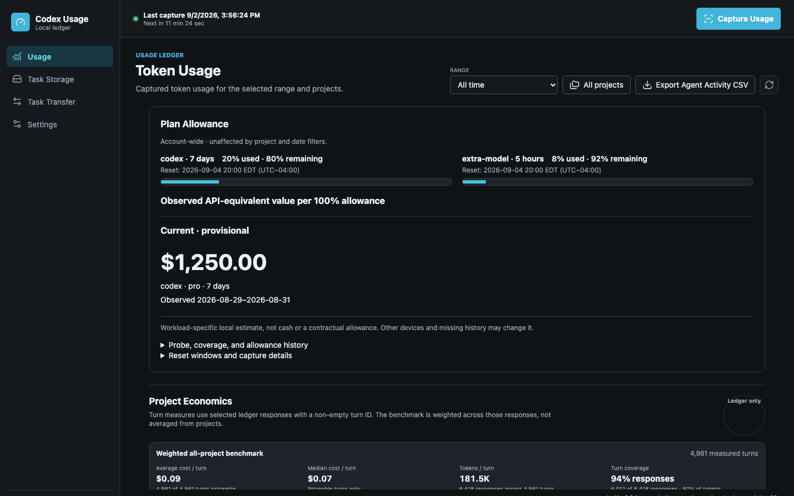
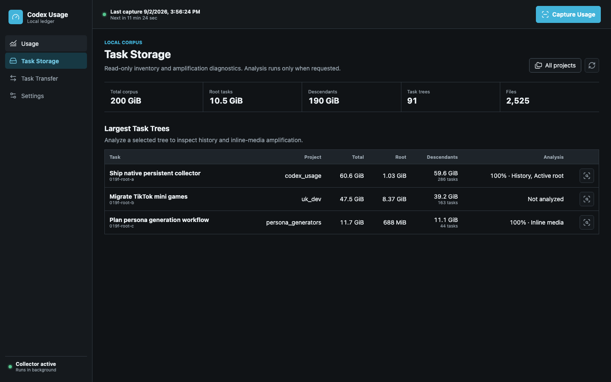

# Codex Usage

Codex Usage is a local toolkit for understanding Codex token usage, model mix,
project activity, and task storage. The standalone VS Code extension includes
its own collector; an optional native app preview adds capture that can continue
after VS Code and the Codex Usage window are closed.

Everything stays on your computer. Capturing usage does not call a model or the
OpenAI API.



## Highlights

- **Persistent local history:** captured usage remains in the ledger after a
  source task is archived or deleted.
- **Low-I/O collection:** the default schedule runs every 15 minutes. Unchanged
  cycles inspect metadata but open zero JSONLs; normal appends read only guard
  windows and the new tail.
- **Immediate capture:** **Capture Now** coalesces with any running capture and
  resets the next scheduled interval after success.
- **Fast reports:** date, project, and theme changes query the ledger without
  reopening task files.
- **Honest accounting:** Project Breakdown separates root tasks from structured
  subagents and stacks each role by model. Side chats remain disclosed under
  their parent root task when Codex stores no durable discriminator.
- **Task Storage:** inspect current disk use and explicitly analyze one selected
  task tree for history amplification and inline media.
- **Task Transfer:** deliberately export or import selected active tasks from one
  project at a time through a user-managed folder.

## Install

Install [Codex Usage Companion](https://marketplace.visualstudio.com/items?itemName=wenjun-mao.codex-usage-dashboard)
from the VS Code Marketplace. Separate macOS Apple Silicon and Windows x64
packages each include the matching local collector; the native app, Python,
`uv`, and this repository are not required.

The optional native app is currently an unsigned preview for macOS 13 or later
on Apple Silicon and Windows 10 or later on x64. Preview builds and their SHA-256
integrity metadata are available from the
[latest distribution workflow](https://github.com/Wenjun-Mao/codex_usage/actions/workflows/package-vsix.yml).
macOS Gatekeeper or Windows SmartScreen may warn because the builds are not
Developer ID notarized or Authenticode signed. The native preview is not needed
for any extension command.

Intel macOS, Windows ARM64, and Linux are not supported in the 2.0 release line.

## Native App First Run

1. Open Codex Usage and choose the Codex home containing `sessions` or
   `archived_sessions`. The usual location is `~/.codex` on macOS or
   `%USERPROFILE%\.codex` on Windows.
2. Choose whether capture should continue after the app closes. Background
   capture is opt-in and registers only for your user account.
3. Keep the balanced 15-minute interval, choose 1 to 1,440 minutes, or select
   **Manual Only**.
4. Optionally enable a GitHub update check at most once per day. Every update
   still requires confirmation.
5. Let the initial baseline continue. Available totals are shown with an
   incomplete-data warning until all discovered files have been processed.

Codex Usage supports one active Codex home. Changing it in **Settings** stops
the collector, validates the new home, switches to that home's ledger, repairs
background registration, and restarts collection.

## Capture And History

The collector reconciles active and archived task directories at the configured
interval. Filesystem notifications only mark paths as dirty; notification
callbacks never read task content. Overdue work after startup, sleep/wake, or a
watcher recovery produces one catch-up rather than replaying every missed tick.

The status header shows the last capture, next scheduled capture, pending files
and bytes, baseline progress, and stale-source warnings. Use **Capture Now** when
you want current data immediately.

Run **Capture Now before manually deleting a Codex task**. A scheduled interval
can leave an uncaptured tail of up to that interval. Once a generation is in the
ledger, its usage is retained when the JSONL disappears, but Codex Usage cannot
restore a deleted task.

The durable ledger lives at:

```text
CODEX_HOME/.codex-usage/usage-ledger.sqlite3
```

It uses forward, backup-protected migrations and is written only by the single
collector process. Task Storage content diagnostics use a separate disposable
database.

## Usage

Open **Usage** to review:

- total, input, cache-read, cache-write, and output tokens;
- effective-dated API-equivalent USD and estimated Codex credits;
- daily and hourly patterns;
- project totals and project transitions;
- root-task versus structured-subagent usage, split again by model;
- exact model details, including unknown or currently unpriced usage.

Choose a date range and any project filter. These controls query SQLite only.
The report shows generation time and whether its rendered-result cache was used.
Pricing is bundled and effective-dated; the app makes no live pricing request.
Estimates are not an OpenAI invoice and do not know the price of your plan.

## Task Storage

Open **Task Storage** to see current physical JSONL usage by user-visible root
task tree. This inventory includes active and archived files, separates root
bytes from structured descendants, and is independent of the Usage date range.



Choose **Analyze** on one tree to measure compacted-history amplification,
inline-media evidence, large descendants, and active-root history risk. Analysis
is selected-tree-only, cancellable, local, and limited to one shared heavy-I/O
lane. It does not invoke a model or scan unrelated trees opportunistically.
The app labels history amplification only after a complete analysis finds at
least 1 GiB of compacted rows representing at least 50% of the tree's logical
bytes. Until then, the result remains visibly **Not analyzed** or incomplete.

For a large task:

- Use **Fork in Codex** when conversational continuity is the priority. A fork
  is not a backup and does not guarantee smaller storage.
- Start a fresh task with a concise handoff when reducing inherited context and
  future growth is the priority.
- Verify the replacement before manually archiving or deleting the original in
  Codex.

Codex Usage does not create, fork, archive, restore, or delete tasks.

## Task Transfer

Task Transfer moves selected active task JSONLs between computers through a
folder managed by OneDrive, Dropbox, iCloud Drive, Syncthing, a network drive,
or another filesystem provider. It is explicit and never runs in the
background. Each Import or Export handles exactly one project.

### Export

1. Open **Task Transfer**, choose **Export**, and select a transfer folder.
2. Choose one project.
3. Choose the exact active tasks to export. No tasks are selected by default,
   and search is limited to that project.
4. Select **Export Selected** and wait for your filesystem provider to finish
   copying the transfer folder.

### Import

1. Clone or otherwise create the matching project checkout on the destination
   computer. Task Transfer does not clone repositories.
2. If using Codex Desktop, add the checkout as a local project and fully quit
   Desktop before Import. VS Code-only use does not require Desktop.
3. Open **Task Transfer**, choose **Import**, and select the same transfer
   folder.
4. Choose one transferred project, choose its tasks, and select the matching
   local checkout.
5. Review any unverified non-Git mapping, then choose **Import Selected**.
6. Start Codex Desktop after success, or reload VS Code in an IDE-only workflow,
   so Codex refreshes its visible task list.

Use **Review Status** to compare selected local and transferred tasks without
copying files. Use **Projects** to go back and choose a different project. Repeat
the operation for another project; one transfer folder can retain many projects.

The complete selected batch is checked before copying. Conflicts, malformed
layouts, changed sources, unsafe project mappings, opposite-direction work, a
running or indeterminate Desktop process, ambiguous Desktop projects, and
assignment conflicts fail closed. Import registers only certified files
through targeted Codex `app-server` reads. Registration does not start a turn or
consume tokens. Import atomically installs selected JSONLs but never edits their content
or writes Codex SQLite databases. Desktop project assignment is atomic, backed
up, and verified while Desktop is closed. Imported files remain in the transfer
folder, and only the transfer-folder path is retained as durable Task Transfer
configuration.

## Legacy Migration

Onboarding discovers schema-8 caches from supported VS Code variants and prior
home-directory locations. Unique generations and retained deleted-source history
can be imported into the durable ledger. Identical overlap is deduplicated;
genuinely divergent history asks which cache takes precedence. Migration is
resumable and auditable, and legacy databases are never changed.

## Privacy And Updates

The app has no telemetry, cloud backend, Docker service, Codex hooks, or model
calls. Session content, usage rows, project paths, and Task Storage diagnostics
stay local. The only optional automatic network activity is a daily GitHub
update check. See [PRIVACY.md](PRIVACY.md) for the complete data boundary.

The Marketplace extension updates through VS Code. Unsigned native previews do
not have a supported automatic update channel; install a newer verified preview
manually. Windows uninstall asks whether to remove ledger and settings and
defaults to preserving them. On macOS, use **Unregister Background Agent** and
**Reset Local Data** before removing the app if you want those effects.

## Development

The repository contains a Python agent/core, an optional Tauri 2 application
under `apps/desktop`, and a standalone TypeScript extension under
`extensions/vscode`.
The Python executable and loopback protocol are private implementation details;
2.0.0 intentionally provides no public `codex-usage` console script.

Run the core gates from the repository root:

```bash
uv sync --all-groups
uv run pytest -q
uv run ruff check .
```

Run native frontend and host gates:

```bash
cd apps/desktop
npm ci
npm test
npm run build
cargo fmt --manifest-path src-tauri/Cargo.toml -- --check
cargo test --manifest-path src-tauri/Cargo.toml --all-targets
```

Run the companion gates:

```bash
cd extensions/vscode
npm ci
npm test
npm run package:vsix
```

Architecture decisions are indexed in [docs/adr](docs/adr/README.md). Signed
release requirements and native packaging checks are in
[docs/release.md](docs/release.md).
