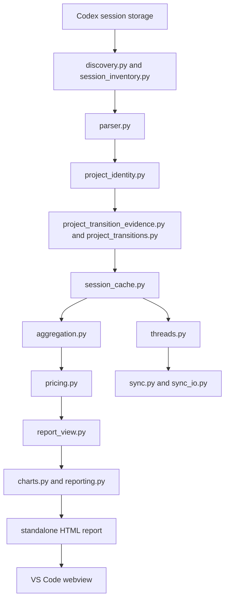

# Architecture Map

Codex Usage has two layers:

- Python core: data discovery, parsing, identity, cache, aggregation, pricing, reports, sync.
- VS Code wrapper: commands, settings/global state, status bar, webview lifecycle, bundled executable invocation.

The Python core is the source of truth. TypeScript should not reimplement usage math.

## System Flow

## Boundaries

Discovery owns where Codex files live. It should know about `CODEX_HOME`, `%USERPROFILE%\.codex`, `~/.codex`, current sessions, and archived sessions.

Parsing owns converting JSONL events to `UsageRecord` objects. It should not know about UI, VS Code, or chart rendering.

Project identity owns canonical project keys. It resolves git remotes, path aliases, and labels. Aggregation should consume this identity instead of guessing from labels.

Project transitions own repo rename or path-switch behavior. They are separate from basic identity because transition detection depends on evidence over time.

The cache owns speed and retention. It stores parsed rows in SQLite so range switching can reuse unchanged files and historical usage can survive deleted local JSONL files after they have been parsed once.

Aggregation owns grouping records. It also calls pricing per record timestamp so effective-dated rates are applied correctly.

Report view models own chart-ready data. Rendering should not perform core math.

Reporting owns local HTML/CSS/SVG. It stays dependency-light and webview-compatible.

VS Code owns user interaction. It should build command arguments, spawn the bundled executable, inject a strict webview CSP, and manage status bar state.

Sync owns selected-conversation file transfer through a user-provided folder. It should never sync auth, config, caches, logs, or SQLite databases.

## Data Flow Contract

Raw JSONL is messy and local. `UsageRecord` is the internal contract that makes the rest of the system simpler.

Important fields:

- `timestamp`: prices and range filters depend on event time.
- `usage`: token deltas, not cumulative totals.
- `model`: pricing lookup key.
- `session_id`: conversation identity.
- `project_key`: stable grouping key.
- `project_aliases`: backwards-compatible filter keys.
- `file_path`: retention, cache, and diagnostics.

Future me: whenever a feature feels awkward, ask whether `UsageRecord` is missing a concept or whether the new feature belongs in a later view model.

